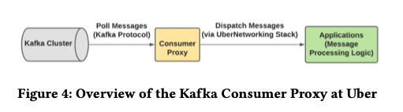

# Real-time Data Infrastructure at Uber 

(2021)

[link to article](../../distributed_systems/Real-time\ Data\ Infrastructure\ at\ Uber.pdf)

https://arxiv.org/abs/2104.00087

A basic outline of all the components.

The paper has a discussion of each of the components' role.

Real-time OSS project landscape @ Uber:

## Their modifications to the OSS stack

* Kafka:
  * cluster federation
  *  dead letter queue
  *  consumer proxy - a quick glance at the description suggests something along the line of [Hermes](https://github.com/allegro/hermes)
  
  * cross-cluster replication
* Apache Flink
  * FlinkSQL - for building streaming analytical applications with SQL. Things implemented along the way:
    * resource estimation and auto scaling
    * job monitoring and automatic failure recovery
  * unified architecture for deployment, management and operation
* apache pinot for OLAP - was compared with Elasticsearch and Apache Druid. Came out faster (than Elasticsearch) and better equipped (better algorithms than Druid).
  * Pinot support upserts !!
  * has full SQL support
* HDFS for storage
* Presto for Interactive Querying
* 

## Things to look into

* Apache Pinot
* Uber OSS projects:
  * Piper - workflow management system
  * Peleton - job scheduler
  * 