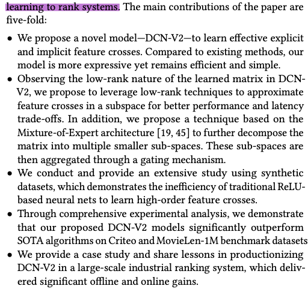
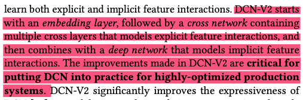
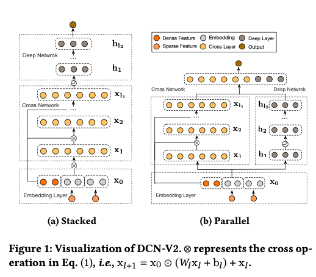
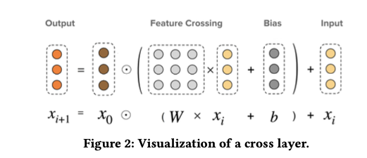

# DCN V2: Improved Deep & Cross Network and Practical Lessons for Web-scale Learning to Rank Systems

https://arxiv.org/abs/2008.13535

## Related work

* DeepFM
* xDeepFM
* DLRM
* AutoInt - multi-head self-attention with residual connections

## The model

Model accepts arbitrary embedding sizes. And isn't in fact limited to the embedding methods described in the paper, any other embedding method can be adopted.

There are two ways to combine deep and cross components:
* stacked 
* parallel

Both serve well for different data sets.

To better deploy the model in production, factorize the embedding matrices into Mixture of Experts 

## Productionizing DCN-V2 at Google

