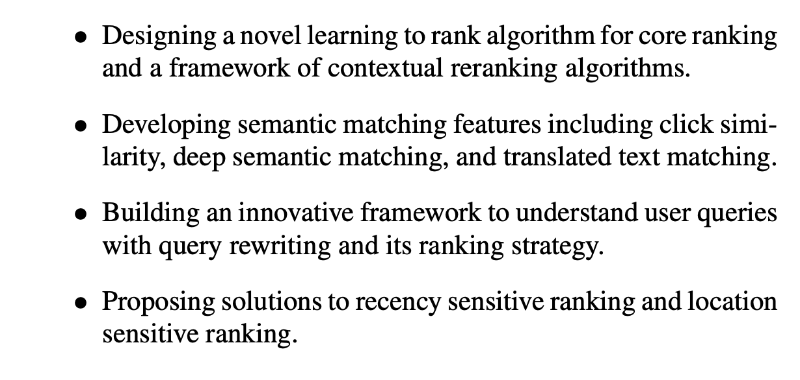

# Ranking Relevance in Yahoo Search

https://www.kdd.org/kdd2016/papers/files/adf0361-yinA.pdf

Key contributions:

Stages of query:
* find all matching documents (recall)
* first rount sort - a lightweight function that scores each document
* uniquing - enforce simple diversity constraints such as a limit on th number of documents from a single host or domain
* query dependent features are extracted from the top candidates
* second round ranking function - much more expensive
* 