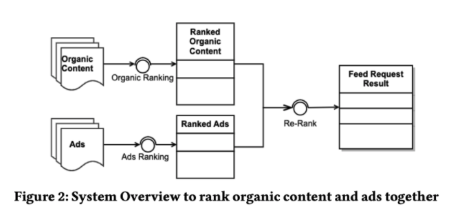
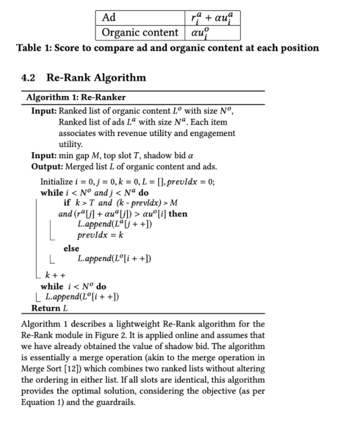
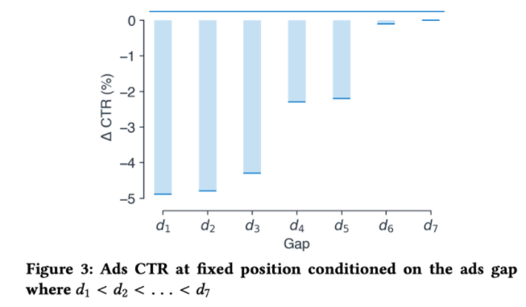

## Ads Allocation in Feed via Constrained Optimization

https://www.kdd.org/kdd2020/accepted-papers/view/ads-allocation-in-feed-via-constrained-optimization 

* Organic ranking - optimize engagement
* Ads ranking - optimize revenue

Blending layer:
* Merge two lists of items - organic and ads, create a unified list which maximizes revenue and engagement
* Respect prior ranking while blending

User experience Guardrails:
* Top slot - the highest eligible position of the first ad
* Min gap - minimum distance between two consecutive ads’ positions

Problem formulation:
* Two utilities, Expected Engagement Utility, Expected Revenue Utility

## Gap Effect
As Figure 3 shows, ads CTR drops with smaller gaps. We examined the impact to organic items as well. However, unlike the significant effect of the gap on ads’ CTR, we did not observe significant impact on users feedback to organic items.

