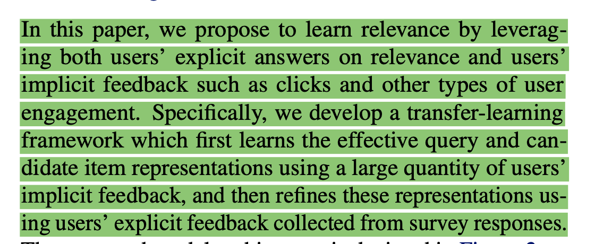
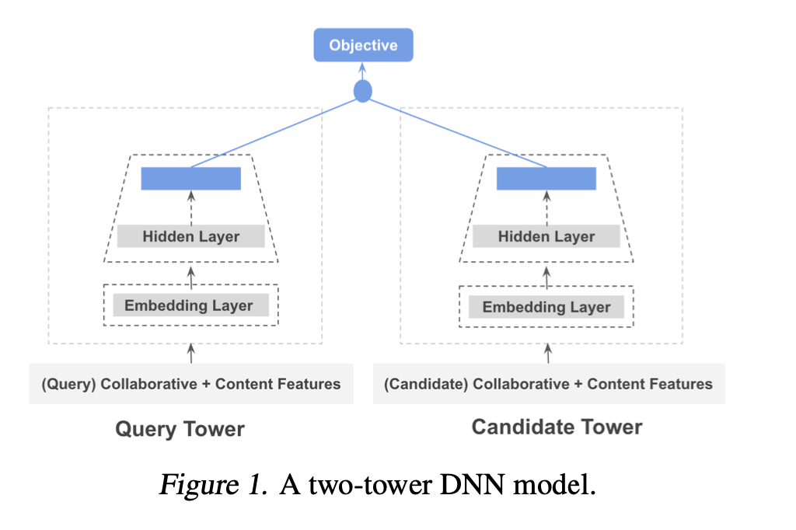
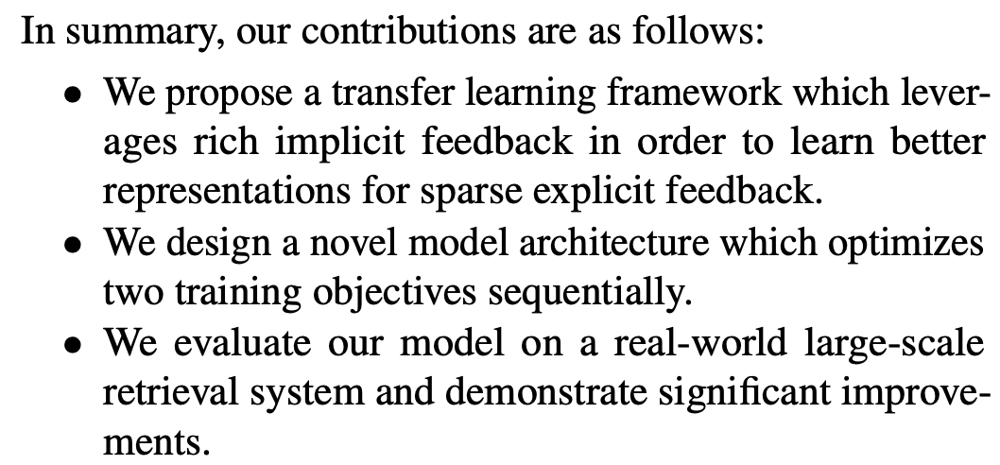
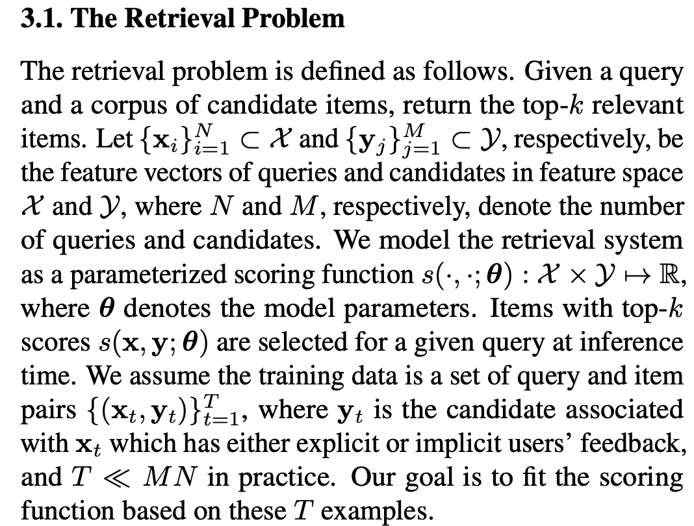
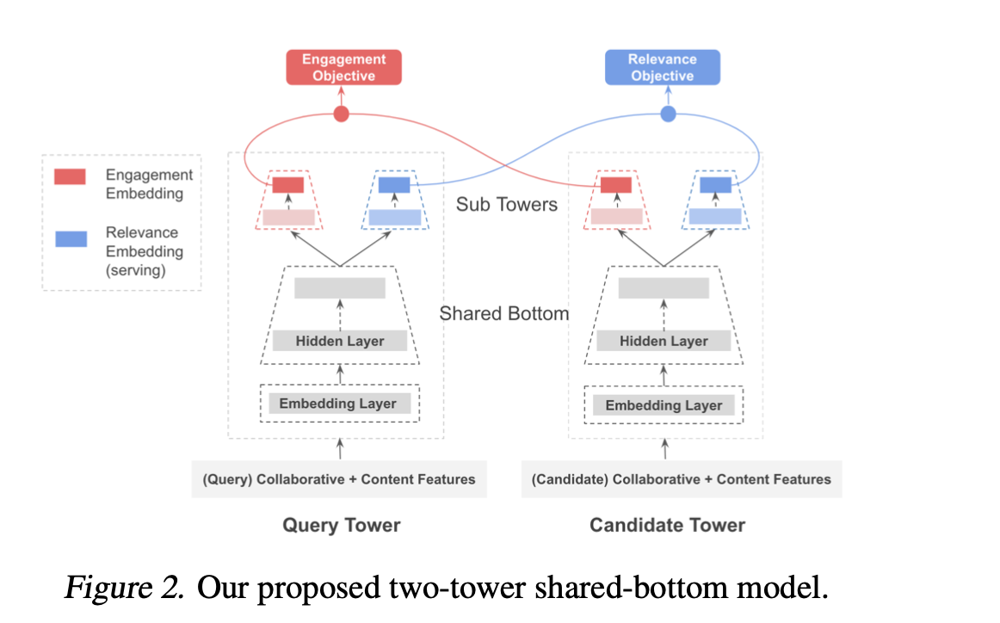
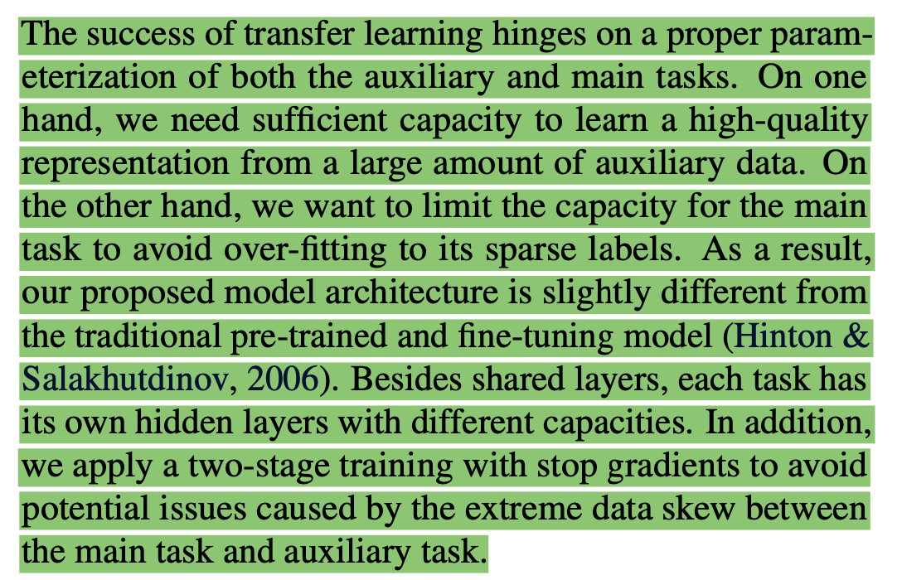

# Improving Relevance Prediction with Transfer Learning in Large-scale Retrieval Systems

https://openreview.net/pdf?id=SJxPVcSonN

## Contributions

## The problem

## Adopting the two-tower architecture to multi-task Learning

## Training schema

1. first train the model for the auxiliary user engagement objective (with cross-entropy loss)
2. having learned the shared representations, fine tune the model for the main relevanve objective (squared loss)
3. (to prevent overfitting) apply stop gradients for the relevance objective on the shared-bottom layers

**For serving** they only need to store and serve the top layer of the two relevance sub-towers to predict the relevance.

## The success of transfert learning...

## Follow ups

Other ways of transfer learning:
* mixture of experts, 
* gating

