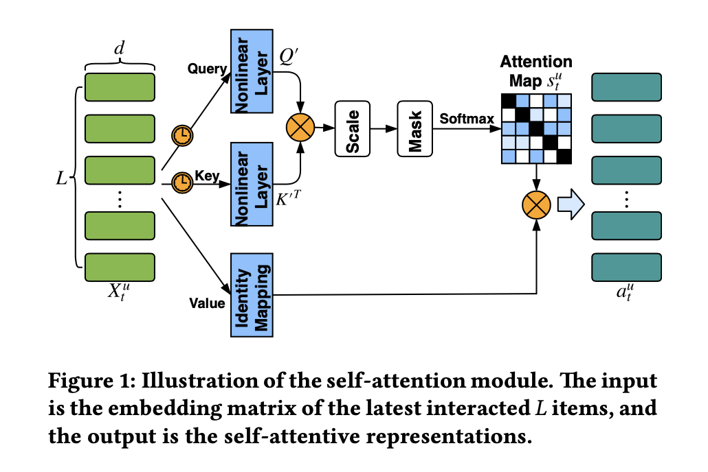
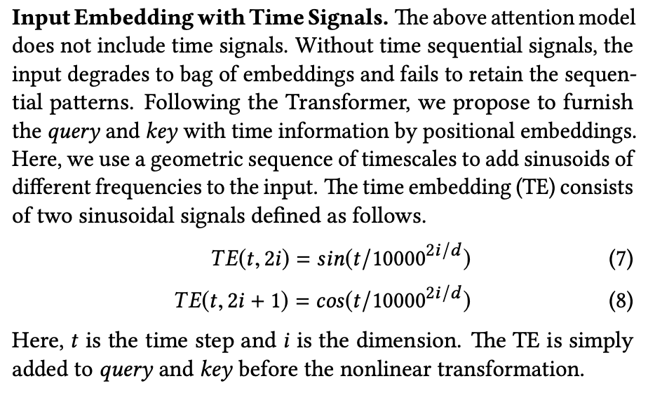
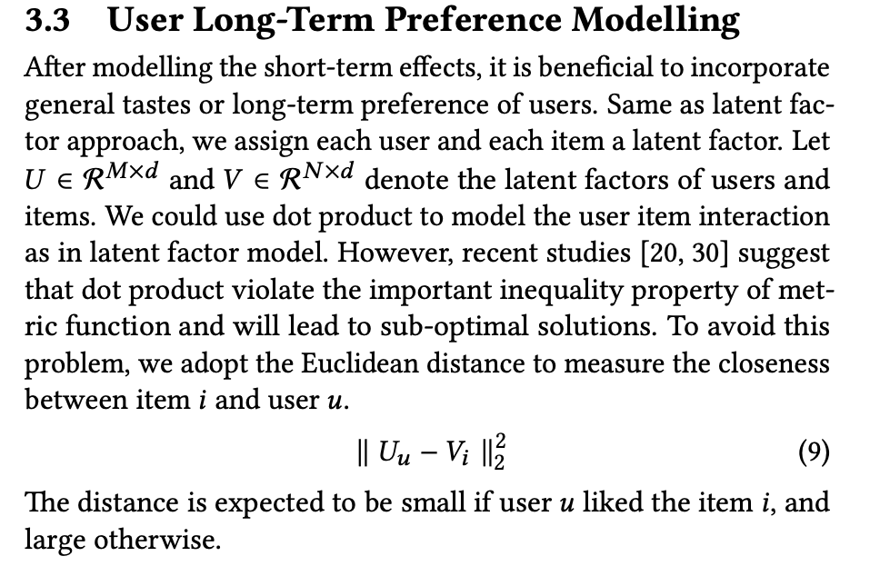

# Next Item Recommendation with Self-Attention

https://arxiv.org/abs/1808.06414

Differerences to STAMP:
* self-attention - instead of attention - Unlike basic attention that learns representations with limited knowledge of the whole context, self-attention can keep the contextual sequential information and capture the relationships between elements in the sequence, regardless of their distance
* input embeddings with time signals

Supposedly a problem with dot product during metric learning:

Solution: use Euclidean distance instead!