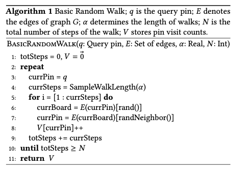
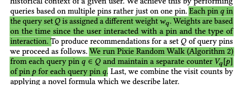
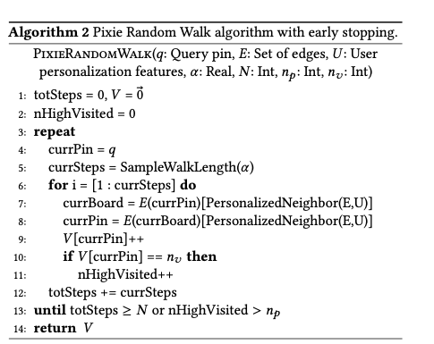
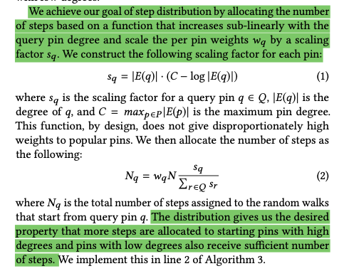
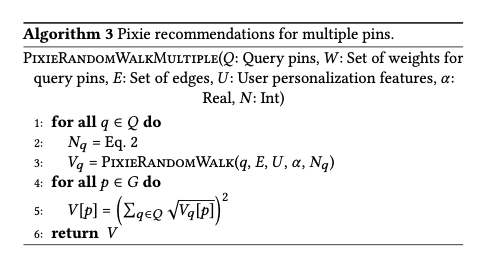
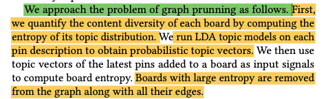

# Pixie: A System for Recommending 3+ Billion Items to 200+ Million Users in Real-Time

https://arxiv.org/abs/1711.07601

## Basic Random Walk algorithms

## Pixie Random Walk
Improvements upon Basic Random Walk:
* Biasing the random walk towards user-specific pins
* Multiple query pins each with a different weight
* Multi-hit booster that boosts pins that are related to multiple query pins
* Early stopping that minimizes the number of steps of the random walk while maintaining the quality of the results

Pixie algorithm takes as input a set of user features U.

PixieRandomWalk selects edges with `PersonalizedNeighbor(E, U)` - to prefer edges important for user U.

### Multi-hit booster
implemented in line 5 of Algorithm 3

## Graph pruning
