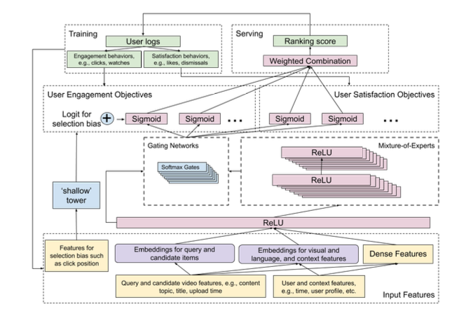
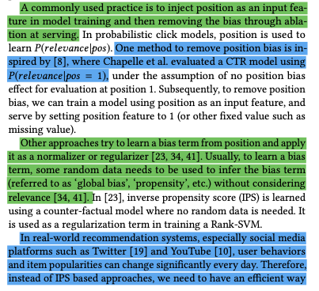
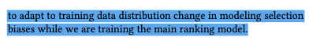
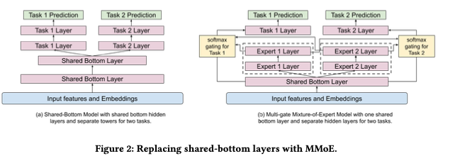
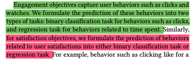

# Recommending What Video to Watch Next: A Multitask Ranking System

[link to DOI site](https://dl.acm.org/doi/10.1145/3298689.3346997)

[link to article](../../../../machine_learning/recommendations/Recommending What Video to Watch Next: A Multitask Ranking System.pdf)

## Contributions
* mixture of experts models - to optimize for multiple ranking objectives
* how to mitigate selection bias

## The model

An extension of [[Wide and Deep Learning for Recommender Systems]] idea.

* objectives' grouping:
    * engagement objectives - user clicks, degree of engagement
    * satisfaction objectives - user liking a Video
* main idea of Mixture of Experts 
  * modularize input layers into experts, which is aimed at improving representation learned from complicated feature space generated by multiple modalities
  * than by using gating networks, each objective can choose experts to share or not share with others

* bias removal - by adding shallow tower to the main model - the shallow tower takes input related to selection bias - and outputs a scalar, serving as a bias term to the final prediction of the main model
  
  

## Related works

### Multi-objective learning in candidate generation stage

[[Why-I-like-it-Multi-task-Learning-for-Recommendation-and-Explanation]]

### Understanding and modeling bias in training data

## Problem statement

* multimodal feature space
* video recommendation system uses multiple candidate generation algorithms, each of which captures one aspect of similarity between query video and candidate video

### Candidate generation

* model is based on https://static.googleusercontent.com/media/research.google.com/en//pubs/archive/45530.pdf
* plus this for training [[Efficient Training on Very Large Corpora via Gramian Estimation]]

## Model architecture

### Ranking objectives

### modeling task relations and conflicts

## Experiments

* sequential retraining
* 

## Conclusion

* more advanced models to come
* ranking distilation: [[Ranking Distillation: Learning Compact Ranking Models With High Performance for Recommender System]] https://arxiv.org/abs/1809.07428
* 
## More interesting papers

[Efficient Training on Very Large Corpora via Gramian Estimation](https://arxiv.org/abs/1807.07187) - mentioned in introduction as an example of neural model used in candidate generation stage

[[Modeling Task Relationships in Multi-task Learning with Multi-gate Mixture-of-Experts]] - mentioned in introduction - as an extension of wide & deep model architecture

[Practical Lessons from Developing a Large-Scale Recommender System at Zalando](https://github.com/YuyangZhangFTD/awesome-RecSys-papers/blob/master/RecSys17/Practical%20Lessons%20from%20Developing%20a%20Large-Scale%20Recommender%20System%20at%20Zalando.pdf)

[Pixie: A System for Recommending 3+ Billion Items to 200+ Million Users in Real-Time](https://dl.acm.org/doi/pdf/10.1145/3178876.3186183)

[Visual Discovery at Pinterest](https://arxiv.org/abs/1702.04680)